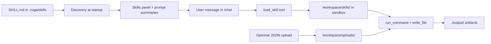

import { Callout } from 'fumadocs-ui/components/callout';
import { Card, Cards } from 'fumadocs-ui/components/card';
import { Steps, Step } from 'fumadocs-ui/components/steps';
import { Tabs, TabsList, TabsTrigger, TabsContent } from 'fumadocs-ui/components/tabs';
import { Accordion, Accordions } from 'fumadocs-ui/components/accordion';
import { BookOpen, Box, Download, Sparkles, Upload, Terminal } from 'lucide-react';

# Agent Skills

Agent skills are reusable instruction packs. Each skill is a folder with **`SKILL.md`** (YAML frontmatter + markdown body) and optional helper scripts.

CUGA discovers skills at startup, lists short **descriptions** in the agent prompt, and exposes **`load_skill`** so the model pulls the full playbook only when a task matches — keeping the system prompt small.

<Cards>
  <Card title="Reusable playbooks" icon={<BookOpen />}>
    Capture domain workflows once, then reuse them across tasks.
  </Card>
  <Card title="On-demand context" icon={<Download />}>
    Load full skill instructions only when the task needs them.
  </Card>
  <Card title="Sandbox-ready assets" icon={<Box />}>
    Ship scripts with the skill; CUGA copies them into `/workspace/skills/` for `run_command`.
  </Card>
</Cards>

<Tabs defaultValue="overview">

<TabsList>
  <TabsTrigger value="overview">Overview</TabsTrigger>
  <TabsTrigger value="pptx">Example: PPTX skill</TabsTrigger>
  <TabsTrigger value="build">Example: Build your own</TabsTrigger>
</TabsList>

<TabsContent value="overview">

## How CUGA works with skills



| Step | What happens |
| ---- | ------------- |
| **Discovery** | CUGA scans one configured root for `**/SKILL.md`, reads `name` + `description` from frontmatter |
| **Prompt** | Short skill summaries appear in the system prompt; full body is **not** inlined |
| **`load_skill`** | Model calls the tool when the task matches a skill description; full markdown body is injected |
| **Sandbox copy** | Skill folder (scripts, templates) is copied to `/workspace/skills/<name>/` |
| **Execution** | Agent follows the skill playbook using filesystem + shell tools in the sandbox |
| **Uploads** | JSON dropped in `/chat` lands in `/workspace/uploads/` (thread-scoped) for skills that need data |

## Where skills live

CUGA scans **one** directory — no merge across paths. Default is the CUGA-native layout:

```text
.cuga/skills/<skill-name>/SKILL.md
```

Configure in `src/cuga/settings.toml`:

```toml
[skills]
enabled = true
root = "cuga"   # default
```

| `skills.root` | Path | When to use |
| ------------- | ---- | ----------- |
| `cuga` (default) | `.cuga/skills/` | Recommended — keeps skills with CUGA policy, workspace, and uploads |
| `agents` | `.agents/skills/` | If you prefer to leave skills where `npx skills` installs them |
| `global_agents` | `~/.config/agents/skills/` | Global `npx skills -g` |
| `global_cuga` | `~/.config/cuga/skills/` | Legacy global CUGA path |

Override at runtime: `export SKILLS_ROOT=agents`

<Callout type="info">
The [skills CLI](https://github.com/vercel-labs/skills) with **`-a universal`** writes to **`.agents/skills/`**, not `.cuga/skills/`. After installing, **move or copy** the skill folder into `.cuga/skills/` (see the PPTX example tab), or set `root = "agents"`.
</Callout>

## Quick start

From the CUGA repository root:

```bash
cuga start demo_skills
```

Open **http://localhost:7860/chat**. The **Skills** panel lists discovered skills; **`load_skill`** is available when `[skills] enabled = true`.

`demo_skills` enables skills and shell tooling for that run. Default sandbox is `sandbox_mode = "native"` (macOS `sandbox-exec`; falls back to `local` on other platforms).

## Configuration

```toml
[skills]
enabled = true
root = "cuga"

[advanced_features]
enable_shell_tool = true   # required for run_command / skill scripts
sandbox_mode = "native"    # "native", "opensandbox", "e2b", or "local"

[policy]
enabled = true             # tool approvals; recommended with shell tools
```

| Setting | Use |
| --- | --- |
| `skills.enabled` | Skill discovery, `load_skill`, `/api/skills`, sandbox skill upload |
| `skills.root` | Single skills directory to scan |
| `advanced_features.enable_shell_tool` | `run_command`, `write_file`, and skill helper scripts |
| `advanced_features.sandbox_mode` | Where shell-style tools execute |
| `policy.enabled` | Policy system including tool approvals |

<Callout type="warning">
Use `sandbox_mode = "local"` only in trusted dev environments. Pair with tool approval.
</Callout>

### Sandbox backends

<Tabs defaultValue="native">
  <TabsList>
    <TabsTrigger value="native">Native</TabsTrigger>
    <TabsTrigger value="opensandbox">OpenSandbox</TabsTrigger>
    <TabsTrigger value="local">Local</TabsTrigger>
  </TabsList>

  <TabsContent value="native">
    Default on macOS — good for local development.

    ```bash
    cuga start demo_skills
    ```
  </TabsContent>

  <TabsContent value="opensandbox">
    Docker or remote isolation; skill files are synced into the sandbox workspace.

    ```bash
    uv sync --extra opensandbox
    cuga start demo_skills
    ```

    ```toml
    [advanced_features]
    sandbox_mode = "opensandbox"
    ```
  </TabsContent>

  <TabsContent value="local">
    Runs on the host — trusted environments only.

    ```toml
    [advanced_features]
    sandbox_mode = "local"
    enable_shell_tool = true
    ```
  </TabsContent>
</Tabs>

</TabsContent>

<TabsContent value="pptx">

## Anthropic PPTX skill

The [Anthropic skills repo](https://github.com/anthropics/skills) includes a **`pptx`** skill for creating, reading, and editing PowerPoint files.

<Steps>

<Step title="Install with the skills CLI">

```bash
npx skills add https://github.com/anthropics/skills --skill pptx -a universal
```

The CLI installs to **`.agents/skills/pptx/`** (universal agent layout). CUGA’s default root is **`.cuga/skills/`**, so move the skill:

```bash
mkdir -p .cuga/skills
mv .agents/skills/pptx .cuga/skills/
```

Your skill path should be:

```text
.cuga/skills/pptx/SKILL.md
```

<Callout type="info">
Alternatively, skip the move and set `[skills] root = "agents"` in `settings.toml`.
</Callout>

</Step>

<Step title="Start CUGA with skills">

```bash
cuga start demo_skills
```

Open **http://localhost:7860/chat** and confirm **pptx** appears in the Skills panel.

</Step>

<Step title="Ask for a deck">

```text
Create a 5-slide sales overview deck about our product roadmap.
```

CUGA should call **`load_skill("pptx")`**, follow the skill’s instructions, and use bundled scripts from `/workspace/skills/pptx/`.

</Step>

</Steps>

Use `-g` on the `npx skills` command for a global install under `~/.config/agents/skills/` — then set `skills.root = "global_agents"` or copy into `.cuga/skills/`.

</TabsContent>

<TabsContent value="build">

## Build your own skill (E2E)

Walk through authoring a skill with a helper script, configuring CUGA, using **`/chat`**, and optionally uploading JSON data.

<Callout type="info">
Sample files in [cuga-agent `docs/examples/skills-playbook/`](https://github.com/cuga-project/cuga-agent/tree/main/docs/examples/skills-playbook): **`snapshot-report`** skill + `sales_q1.json`.
</Callout>

<Steps>

<Step title="Clone CUGA and configure a model">

```bash
git clone https://github.com/cuga-project/cuga-agent.git
cd cuga-agent
uv sync
cp .env.example .env
```

Uncomment **one** provider block in `.env` (Groq, OpenAI, OpenAI-compatible via `settings.openai.toml` + `OPENAI_BASE_URL`, WatsonX, etc.). See [Model Configuration](/docs/customization/llm-config).

</Step>

<Step title="Enable skills and add the sample skill">

```toml
# src/cuga/settings.toml
[skills]
enabled = true
root = "cuga"

[advanced_features]
enable_shell_tool = true
sandbox_mode = "native"
```

```bash
mkdir -p .cuga/skills
cp -R docs/examples/skills-playbook/sample-skill/snapshot-report .cuga/skills/
```

Expected layout:

```text
.cuga/skills/snapshot-report/
├── SKILL.md
└── summarize_upload.py
```

</Step>

<Step title="Start and open /chat">

```bash
cuga start demo_skills
```

Open **http://localhost:7860/chat** → **Skills** panel should list **snapshot-report**.

</Step>

<Step title="Upload data (optional)">

1. Start a conversation (upload needs an active thread)
2. Drag **`docs/examples/skills-playbook/sample-data/sales_q1.json`** onto the chat area
3. File appears under **`/workspace/uploads/`** in the Workspace panel

</Step>

<Step title="Run the skill">

```text
Load the snapshot-report skill and summarize my uploaded sales JSON. Write the report to output/.
```

The agent should **`load_skill`**, run `uv run python /workspace/skills/snapshot-report/summarize_upload.py …`, and write **`./output/snapshot-report-<timestamp>.md`**.

</Step>

</Steps>

### Minimal SKILL.md (roll your own)

```markdown
---
name: hello
description: Friendly greeting demo. Use when the user asks for a hello-world skill test.
---

Reply with a short greeting and one tip about CUGA skills.
```

Save as `.cuga/skills/hello/SKILL.md` and restart CUGA.

### Troubleshooting

<Accordions type="single">

<Accordion id="no-skills" title="Skills panel empty">

- `[skills] enabled = true` or `cuga start demo_skills`
- Files at `.cuga/skills/<name>/SKILL.md` when `root = "cuga"`
- Restart after adding skills

</Accordion>

<Accordion id="universal-path" title="Installed with npx skills but CUGA does not see it">

- Universal installs go to `.agents/skills/` — move to `.cuga/skills/` or set `root = "agents"`

</Accordion>

<Accordion id="upload" title="Upload disabled">

- Send a message first to start a thread; only JSON uploads are supported in chat UI

</Accordion>

</Accordions>

<Cards>
  <Card href="https://skills.sh" title="skills.sh" description="Browse community skills" icon={<Upload />} />
  <Card href="/docs/customization/llm-config" title="Model config" description="OpenAI, WatsonX, Groq, and more" icon={<Terminal />} />
  <Card href="https://github.com/cuga-project/cuga-agent/tree/main/docs/examples/skills-playbook" title="Sample skill source" description="snapshot-report + helper script" icon={<Sparkles />} />
</Cards>

</TabsContent>

</Tabs>
