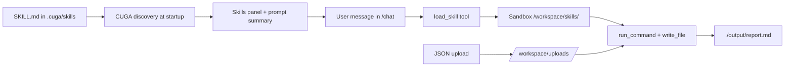

import { Callout } from 'fumadocs-ui/components/callout';
import { Card, Cards } from 'fumadocs-ui/components/card';
import { Steps, Step } from 'fumadocs-ui/components/steps';
import { Tabs, TabsList, TabsTrigger, TabsContent } from 'fumadocs-ui/components/tabs';
import { Accordion, Accordions } from 'fumadocs-ui/components/accordion';
import { Sparkles, Upload, Terminal, BookOpen } from 'lucide-react';

<Cards>
  <Card
    title="What you will build"
    description="A snapshot-report skill that reads uploaded JSON and writes a markdown report"
    icon={<Sparkles />}
  />
  <Card
    title="Where you work"
    description="Clone cuga-agent, copy a sample skill to .cuga/skills/, open /chat"
    icon={<Terminal />}
  />
  <Card
    title="Optional uploads"
    description="Drag JSON into chat — files land in workspace/uploads/ for the agent"
    icon={<Upload />}
  />
</Cards>

Agent **skills** are reusable playbooks: each skill is a `SKILL.md` file with YAML frontmatter plus optional helper scripts. CUGA lists skill names in the prompt and exposes **`load_skill`** so the model pulls full instructions only when a task matches — keeping the system prompt lean.

This playbook walks through the full loop: **author or install a skill → configure a model → start CUGA → use `/chat` → optionally upload files → run the skill in the sandbox**.

<Callout type="info">
**Sample files in cuga-agent:** [`docs/examples/skills-playbook/`](https://github.com/cuga-project/cuga-agent/tree/main/docs/examples/skills-playbook) includes `snapshot-report` (`SKILL.md` + `summarize_upload.py`) and sample JSON data.
</Callout>

## How skills are loaded

CUGA scans **one** skills directory (no merge). Configure it in `src/cuga/settings.toml`:

```toml
[skills]
enabled = true
root = "cuga"   # default → .cuga/skills/
```

| `skills.root` | Path | When to use |
| ------------- | ---- | ----------- |
| `cuga` (default) | `.cuga/skills/` | CUGA-native layout; keeps skills with policy and workspace config |
| `agents` | `.agents/skills/` | Installs from [skills.sh](https://skills.sh) / `npx skills` |
| `global_agents` | `~/.config/agents/skills/` | Global `npx skills -g` |
| `global_cuga` | `~/.config/cuga/skills/` | Legacy global CUGA path |

Override at runtime: `export SKILLS_ROOT=agents`

---

## Part 1 — Clone and configure CUGA

<Steps>

<Step title="Clone and install">

```bash
git clone https://github.com/cuga-project/cuga-agent.git
cd cuga-agent
uv sync
```

See [Installation](/docs/getting-started/installation) for prerequisites (Python 3.12+, UV).

</Step>

<Step title="Configure your model">

CUGA supports multiple LLM backends. Pick **one** provider block in `.env` and set `AGENT_SETTING_CONFIG` to the matching settings file under `src/cuga/configurations/models/`:

| Provider | Settings file | Typical use |
| -------- | ------------- | ----------- |
| **Groq** | `settings.groq.toml` | Fast open models (default in `.env.example`) |
| **OpenAI** | `settings.openai.toml` | OpenAI API |
| **OpenAI-compatible** | `settings.openai.toml` | LiteLLM, local proxies, vLLM, Ollama OpenAI shim — set `OPENAI_BASE_URL` |
| **WatsonX** | `settings.watsonx.toml` | IBM watsonx.ai enterprise models |
| **Azure / OpenRouter / Google** | `settings.azure.toml`, etc. | See [Model Configuration](/docs/customization/llm-config) |

```bash
cp .env.example .env
# Uncomment exactly one provider section in .env and add your credentials
```

<Tabs defaultValue="groq">
  <TabsList>
    <TabsTrigger value="groq">Groq</TabsTrigger>
    <TabsTrigger value="openai">OpenAI</TabsTrigger>
    <TabsTrigger value="compatible">OpenAI-compatible</TabsTrigger>
    <TabsTrigger value="watsonx">WatsonX</TabsTrigger>
  </TabsList>

  <TabsContent value="groq">

Default in `.env.example`. Uncomment the Groq block and add your key:

```bash
# AGENT_SETTING_CONFIG="settings.groq.toml"
# MODEL_NAME="openai/gpt-oss-120b"
# ... GROQ_* from .env.example
```

Install Groq extras if needed: `uv sync --group groq`

  </TabsContent>

  <TabsContent value="openai">

```bash
# AGENT_SETTING_CONFIG="settings.openai.toml"
# MODEL_NAME="gpt-4o"
# ... OPENAI_* from .env.example
```

  </TabsContent>

  <TabsContent value="compatible">

Use **`settings.openai.toml`** with a custom base URL — any server that speaks the OpenAI chat/completions API:

```bash
# AGENT_SETTING_CONFIG="settings.openai.toml"
# OPENAI_BASE_URL="https://your-litellm-or-proxy/v1"
# MODEL_NAME="gpt-4o"           # or the model id your gateway expects
# ... OPENAI_* from .env.example
```

Works with LiteLLM, Azure OpenAI (via base URL), local vLLM/Ollama OpenAI endpoints, and similar gateways.

  </TabsContent>

  <TabsContent value="watsonx">

Use **`settings.watsonx.toml`**. Copy the commented WatsonX block from `.env.example` into `.env` and fill in project id, region URL, and credentials:

```bash
# AGENT_SETTING_CONFIG="settings.watsonx.toml"
# MODEL_NAME="meta-llama/llama-4-maverick-17b-128e-instruct-fp8"
# ... plus WATSONX_* vars from .env.example
```

  </TabsContent>
</Tabs>

<Callout type="info">
Override the model at runtime with `MODEL_NAME` in `.env`. Full provider list and advanced options: [Model Configuration](/docs/customization/llm-config).
</Callout>

</Step>

<Step title="Enable skills">

In `src/cuga/settings.toml`:

```toml
[skills]
enabled = true
root = "cuga"

[advanced_features]
sandbox_mode = "native"   # macOS sandbox-exec; use "opensandbox" with Docker
enable_shell_tool = true  # required for run_command in skills
```

<Callout type="warning">
Skills need **`enable_shell_tool = true`** so the agent can run companion scripts (`uv run python …`) inside the sandbox.
</Callout>

Quick preset (sets skills + shell tools for you):

```bash
cuga start demo_skills
```

This starts the demo agent on port **7860** with skills enabled.

</Step>

</Steps>

---

## Part 2 — Add a skill

<Tabs defaultValue="copy">

<TabsList>
  <TabsTrigger value="copy">Copy sample skill (recommended)</TabsTrigger>
  <TabsTrigger value="author">Write your own SKILL.md</TabsTrigger>
  <TabsTrigger value="install">Install from skills.sh</TabsTrigger>
</TabsList>

<TabsContent value="copy">

From the **cuga-agent repo root**, copy the playbook sample:

```bash
mkdir -p .cuga/skills
cp -R docs/examples/skills-playbook/sample-skill/snapshot-report .cuga/skills/
```

You should have:

```text
.cuga/skills/snapshot-report/
├── SKILL.md
└── summarize_upload.py
```

Restart CUGA after adding or editing skills.

</TabsContent>

<TabsContent value="author">

Create `.cuga/skills/hello/SKILL.md`:

```markdown
---
name: hello
description: Say hello in a friendly way. Use when the user asks for a greeting demo.
---

When triggered, reply with a short greeting and one tip about using CUGA skills.
```

Optional helper script in the same folder — the agent reads it from `/workspace/skills/hello/` after `load_skill`.

Frontmatter **must** include `name` and `description`. The description is how the model decides when to call `load_skill`.

</TabsContent>

<TabsContent value="install">

For community skills via the [Vercel skills CLI](https://github.com/vercel-labs/skills):

```bash
npx skills add vercel-labs/agent-skills --skill frontend-design -a universal
```

That writes to `.agents/skills/`. Point CUGA at it:

```toml
[skills]
root = "agents"
```

Or copy the installed folder into `.cuga/skills/` and keep `root = "cuga"`.

</TabsContent>

</Tabs>

### Sample skill: snapshot-report

The playbook skill summarizes JSON uploads and writes a timestamped markdown file under `./output/`.

**`SKILL.md`** (abbreviated):

```markdown
---
name: snapshot-report
description: Summarize uploaded JSON from workspace/uploads and write a markdown snapshot report.
---

1. list_files('/workspace/uploads')
2. uv run python /workspace/skills/snapshot-report/summarize_upload.py /workspace/uploads/<file>.json
3. write report to ./output/snapshot-report-YYYYMMDD-HHMMSS.md
```

**Companion script** (`summarize_upload.py`) — stdlib-only JSON stats:

```bash
uv run python docs/examples/skills-playbook/sample-skill/snapshot-report/summarize_upload.py \
  docs/examples/skills-playbook/sample-data/sales_q1.json
```

Verify locally:

```bash
uv run python .cuga/skills/snapshot-report/summarize_upload.py --self-check
```

---

## Part 3 — Run end-to-end in `/chat`

<Steps>

<Step title="Start CUGA">

```bash
cuga start demo_skills
```

Open **http://localhost:7860/chat**

</Step>

<Step title="Confirm the skill is listed">

In the right panel, open **Skills**. You should see **snapshot-report** (or your skill name) with its description from frontmatter.

If the list is empty:

- Confirm `[skills] enabled = true` and restart the server
- Confirm files live under `.cuga/skills/<name>/SKILL.md` when `root = "cuga"`

</Step>

<Step title="Upload sample data (optional but recommended for this demo)">

On the chat page:

1. Start a new conversation (upload requires an active thread)
2. Use **Upload** or drag-and-drop a **JSON** file onto the chat area
3. Files appear in the sandbox at **`/workspace/uploads/`** (see **Workspace** panel)

Try the bundled sample:

```bash
# path inside your clone
docs/examples/skills-playbook/sample-data/sales_q1.json
```

<Callout type="info">
Uploads are thread-scoped and listed in `/workspace/uploads/.manifest.json`. The agent discovers them without you pasting file contents into the chat.
</Callout>

</Step>

<Step title="Ask the agent to use the skill">

Example prompts:

```text
Load the snapshot-report skill and summarize my uploaded sales JSON. Write the report to output/.
```

```text
I uploaded a JSON file — give me a quick snapshot report using your skills.
```

The agent should:

1. Call **`load_skill("snapshot-report")`**
2. **`list_files`** / read the manifest under `/workspace/uploads/`
3. **`run_command`** with `uv run python …/summarize_upload.py …`
4. **`write_file`** → `./output/snapshot-report-<timestamp>.md`
5. Reply with the file path and a short summary (not the full report body)

Check **Workspace → output/** for the generated markdown.

</Step>

</Steps>

---

## What happens under the hood



| Piece | Role |
| ----- | ---- |
| `SKILL.md` | Full playbook returned by `load_skill` |
| Companion scripts | Copied to `/workspace/skills/<name>/` in the sandbox |
| `/workspace/uploads/` | Session JSON uploads from the chat UI |
| `./output/` | Agent-written artifacts (reports, exports) |

---

## Troubleshooting

<Accordions type="single">

<Accordion id="no-skills" title="Skills panel shows “No skills installed”">

- Set `[skills] enabled = true` in `settings.toml` or use `cuga start demo_skills`
- Skills must live under the configured root (default `.cuga/skills/<name>/SKILL.md`)
- Restart after file changes

</Accordion>

<Accordion id="load-skill-missing" title="Agent does not call load_skill">

- Make the user message clearly match the skill **description** in frontmatter
- Mention the skill by name: “use the snapshot-report skill”
- Check the Skills panel — if the skill is missing, discovery failed (invalid frontmatter or wrong path)

</Accordion>

<Accordion id="upload-missing" title="Upload button disabled or upload fails">

- Start a chat thread first (send any message)
- Only JSON uploads are supported in the current UI
- Large files (up to 100MB) should be processed with streaming/script commands inside the skill, not `read_file` on the whole file

</Accordion>

<Accordion id="script-fails" title="Companion script fails in sandbox">

- Use `uv run python`, not bare `python`
- Path in sandbox: `/workspace/skills/<skill-name>/script.py`
- Run `uv run python …/summarize_upload.py --self-check` on the host first

</Accordion>

</Accordions>

---

## Next steps

<Cards>
  <Card
    href="/docs/customization/overview"
    title="Configuration"
    description="LLM providers, sandbox modes, and advanced_features"
    icon={<BookOpen />}
  />
  <Card
    href="https://github.com/cuga-project/cuga-agent/tree/main/docs/examples/skills-playbook"
    title="Playbook source"
    description="Sample skill, helper script, and sales_q1.json in cuga-agent"
    icon={<Sparkles />}
  />
  <Card
    href="https://skills.sh"
    title="skills.sh"
    description="Browse and install community skills"
    icon={<Upload />}
  />
</Cards>
